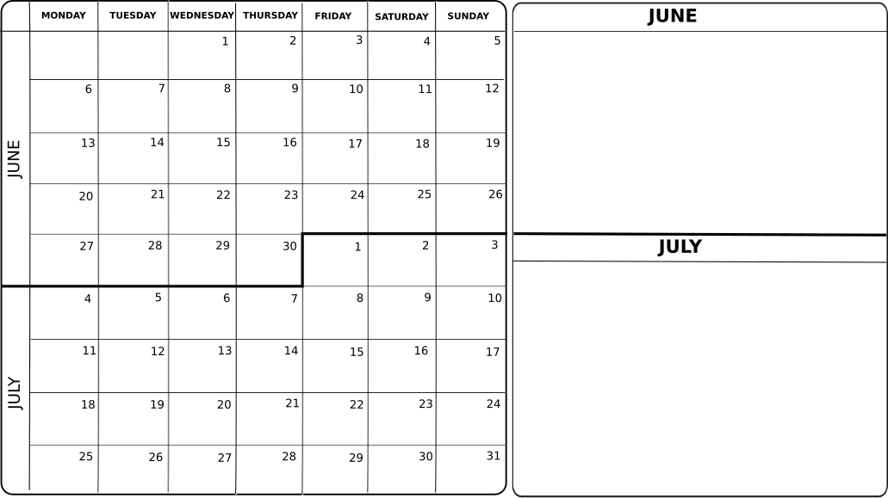
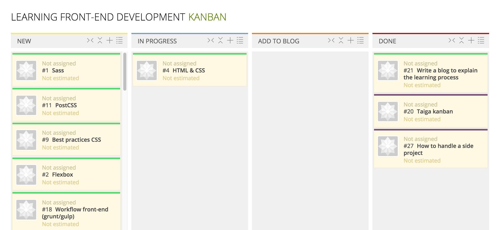

When I saw that the <a href="https://www.koliseo.com/codemotion/codemotion-madrid/r4p/5753906952929280/#/">Call for papers for Codemotion Madrid 2016</a> process was open, I thought that I could explain my journey to becoming a Front-end developer because it can be useful for others. 

As a said in another posts, I am Front-end developer since March last year, but I know that I have to improve a lot. Because of that, I thought that implementing a learning process can help me and others in the same situation improving in this field. The Codemotion conference is in November, so I have 5 months ahead to organize myself, keep improving and show the results there (and here in my blog). If my talk is not chosen, I can still explain this in other meetups or conferences that can be interested in this organization plan and I will also improve my skills in between, so I can't lose. 

Organizing tools
-------------

I use 2 types of calendar that I add to a physical board. The first is the usual one, where I write down the meetups/meetings/free time stuff/trips, etc. With this first calendar I can see when I have time to learn. In the second one I write down the things that I would like to accomplished by month.

The bad thing about the second board is that I don't usually know how many tasks I will accomplish in a month and I would like to reorganize order of tasks in a visual way. 

For that, I am going to start using Kanban with the open source tool <a href="https://taiga.io/">Taiga</a>. In the <a href="https://tree.taiga.io/project/cristinafsanz-improving-in-front-end-development/kanban">learning Front-end development project</a> I will add each task that I would like to accomplish in a user story. In the first version I am adding all the tasks, ideas and resources in the TO-DO column, I don't know if I will separate them in some way to distinguish which kind of task is.

The organization in the Kanban board is the usual for this method, that is, columns TO-DO, DOING and DONE. However, I have added a ADD-TO-BLOG column to write a little explanation, example or conclusion in the blog after finishing doing each task. This way, other people can take advantage of the time inverted there.

Organizing tasks
-------------

I use Evernote to write about each task that I do, make list of things that I need to do to accomplish it or steps that I will use in the future again (for example, steps to upload a new blog post to GitHub). After finishing each task, I can get the important parts from there and adding them to the blog.

Improving front-end development tasks
-------------

These are the tasks for this project:

* Tasks: HTML, CSS & JS, Sass, PostCSS, Flexbox, responsive web design, best practices, workflow front-end development, accesibility, Material Design, UX
	
* Resources: Free books to learn web design, articles

* Ideas: Apply learning with personal projects, go to meetups/conferences, follow people that are where you want to be in front-end development
