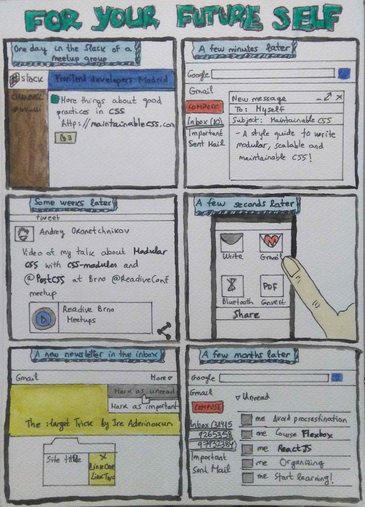

Last weeks I have realized that I am focus now on improving in my career, which is great. But how did I get here?

As Steve Jobs said, "You can't connect the dots looking forward; you can only connect them looking backwards", so I have looked for the dots in twitter :)

A few months ago I joined the meetup group <a href="http://www.meetup.com/es-ES/Front-end-Developers-Madrid/">Front-end Developers Madrid</a> and I am really glad that I did it because I became aware that I need to learn a lot. After some conversations from the group in Slack I used to send interesting articles and courses to the mailbox of my "future self", but after a while I imagined all the tasks in a wall like in the movie "A beautiful mind" and I shared it in twitter:

<blockquote class="twitter-tweet" align="center">
Mi lista de tareas para mejorar en <a href="https://twitter.com/hashtag/frontend?src=hash">#frontend</a> se está pareciendo ya a la pared de ‘Una mente maravillosa&#39; :) <a href="https://twitter.com/hashtag/css?src=hash">#css</a> <a href="https://twitter.com/hashtag/ux?src=hash">#ux</a> <a href="https://t.co/vssfXJiNXT">pic.twitter.com/vssfXJiNXT</a>
&mdash; Cristina Fernández (@cristinafsanz) <a href="https://twitter.com/cristinafsanz/status/730417793389178880">May 11, 2016</a></blockquote>

I didn't really have a plan to improve in front-end development until a very bad weeks at work. I had the idea back then (in the shower, where all the ideas come from) to do a talk about moving from back-end to front-end development and take advantage of it to put pressure on me and improve in these months.

<blockquote class="twitter-tweet" align="center">
Presentada charla para <a href="https://twitter.com/hashtag/codemotion_es?src=hash">#codemotion_es</a>, a ver si este año somos más mujeres <a href="https://t.co/WSPNHIsUey">https://t.co/WSPNHIsUey</a> <a href="https://twitter.com/hashtag/ILookLikeAnEngineer?src=hash">#ILookLikeAnEngineer</a> <a href="https://twitter.com/hashtag/womenInTech?src=hash">#womenInTech</a>
&mdash; Cristina Fernández (@cristinafsanz) <a href="https://twitter.com/cristinafsanz/status/740626334368563200">June 8, 2016</a></blockquote>

I wanted to organize the talk and have all the ideas in the same place and I thought about a Kanban to use different "boxes" for each idea. But after adding some ideas, I started to add also user stories for each thing that I wanted to learn and I realized that it could be very useful to see how a learning goes.

Those days I saw this tweet:

<blockquote class="twitter-tweet" align="center">
#1 answer to &quot;how do I become a better developer?&quot; start a blog. You&#39;ll learn so much + have a reference to all you know, in your own words.
&mdash; Todd Motto (@toddmotto) <a href="https://twitter.com/toddmotto/status/737766510387662848">May 31, 2016</a></blockquote>

So I decided to write about each task in my blog and share the idea:

<blockquote class="twitter-tweet" align="center">
Using <a href="https://twitter.com/taigaio">@taigaio</a> to create a kanban project &quot;Improving in <a href="https://twitter.com/hashtag/frontend?src=hash">#frontend</a> development&quot;, with a custom column AddToBlog between InProgress and Done.
&mdash; Cristina Fernández (@cristinafsanz) <a href="https://twitter.com/cristinafsanz/status/741586091162140672">June 11, 2016</a></blockquote>

What you can learn here is that a bad event can turn into something good and that I like to share in twitter the day 11 of each month, so pay attention to July 11th ;)

By the way, this is a comic about the story of sending resources to the mailbox of my "future self":

 

---

Notes: How to insert tweets in Jekyll posts?

- Used <a href="http://phatblat.com/2016/01/05/jekyll-twitter-plugin.html">Jekyll Twitter Plugin article</a> with <a href="https://github.com/rob-murray/jekyll-twitter-plugin">Rob Murray jekyll twitter plugin</a> to insert tweets in Jekyll.

- Created a <a href="https://apps.twitter.com/app/new"> Twitter application</a> to create the keys and access tokens.

- Using Gemfile and `bundle install` to install the gems and dependencies.

- With OS X 10.11 you have to change the <a href="https://github.com/CocoaPods/CocoaPods/issues/3680">path to /usr/local/bin</a> to install some gems: `gem install -n /usr/local/bin/ jekyll-sitemap`. 

- I created a local file .env to have the keys (it remains only in local, not in GitHub) and I export each line (export TWITTER_ACCESS_TOKEN_SECRET=...) to have it in the environment and test it in local with `bundle exec jekyll serve --baseurl ''`.

- Issues: <a href="https://github.com/rob-murray/jekyll-twitter-plugin/issues/15">The tag twitter is not a recognized Liquid tag</a>. You have to build the HTML locally and then merge the generated code into the gh-pages branch: `bundle exec jekyll build` to generate the html and copy the code from _site to _post.

