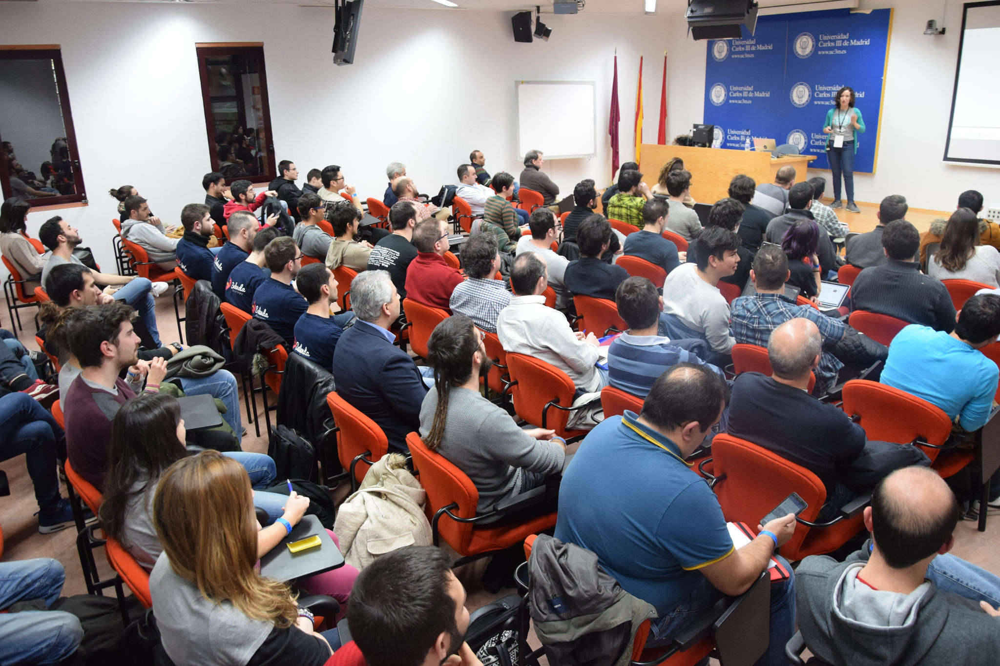

Yesterday I did my very <a href="https://t3chfest.uc3m.es/2017/programa/trucos-fantasticos-donde-encontrarlos">first talk</a> in a technical conference, <a href="https://t3chfest.uc3m.es/2017/">T3chFest</a>, and it has been a very challenging experience. 

I have only 2 years experience in front-end development and I am not an expert, I am an introvert and I don't like speaking in front of an audience, so why do I choose to become a speaker?

First of all, I would like to contribute with my experience the same way other people share what they know. I also think that people like me share less because we think that what we know is not good enough to share it and that is not true. And last but not least, we women in tech need to be more visible for the new generations of women that come.

In my talk I shared my struggle with all the new stuff that comes everyday in Front-end development and I wanted to do it in a entertaining way. I know that I didn't do it perfect and I am far from being a good speaker but some people liked it and they considered it also useful, so this is what matters to me. 

Moreover, the process of doing the talk has been very fun for me. I started reading the Harry Potter books (again) and the script for "Fantastic Beasts and where to find them". I loved the moments when ideas from magic and front-end development connected and I tried to write them down before they vanished. If you don't understand what I am saying, you should see my <a href="https://docs.google.com/presentation/d/1rZkhptFfhwNEmp3k7BKgRPk4b0eNck__nWWjJldxaTk/edit#slide=id.p4">slides</a>, you will understand afterwards.

I also loved how the people that I know from twitter reacted when they saw the talk or the slides, they are a good reason to try things and don't regret it. Thank you all! And most of them are an example/model for me, so I am glad they liked it.

And thanks to this talk I found out that part of this blog has been useful to someone, she uses GitHub Pages and Jekyll now, so I am happy for that.

So this has been a good experience and I will appreciate much more when someone becomes a speaker, it is not easy at all! 

Thanks to the T3chFest organization for selecting my talk and do an awesome event and to <a href="https://twitter.com/sailormercury91">Nerea Luis</a> for telling me that it would be all right, at the end it was true.

- Image of my talk:

