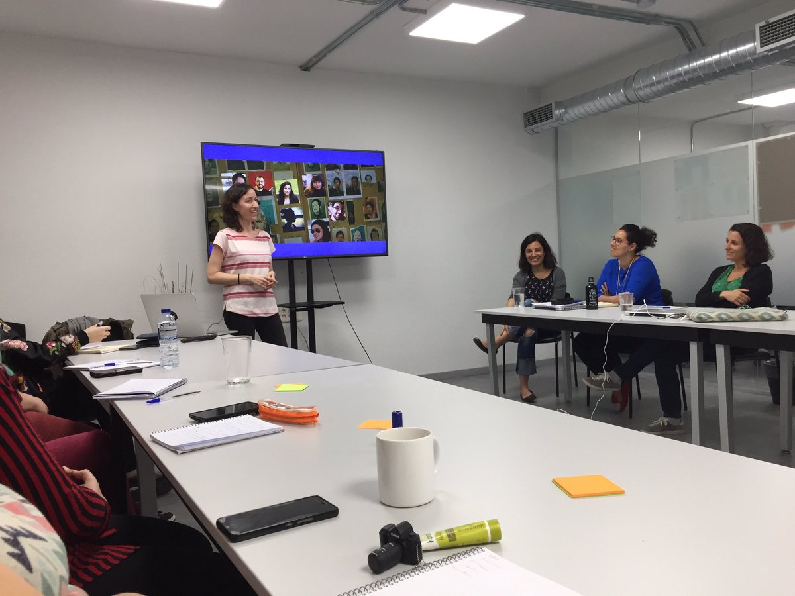
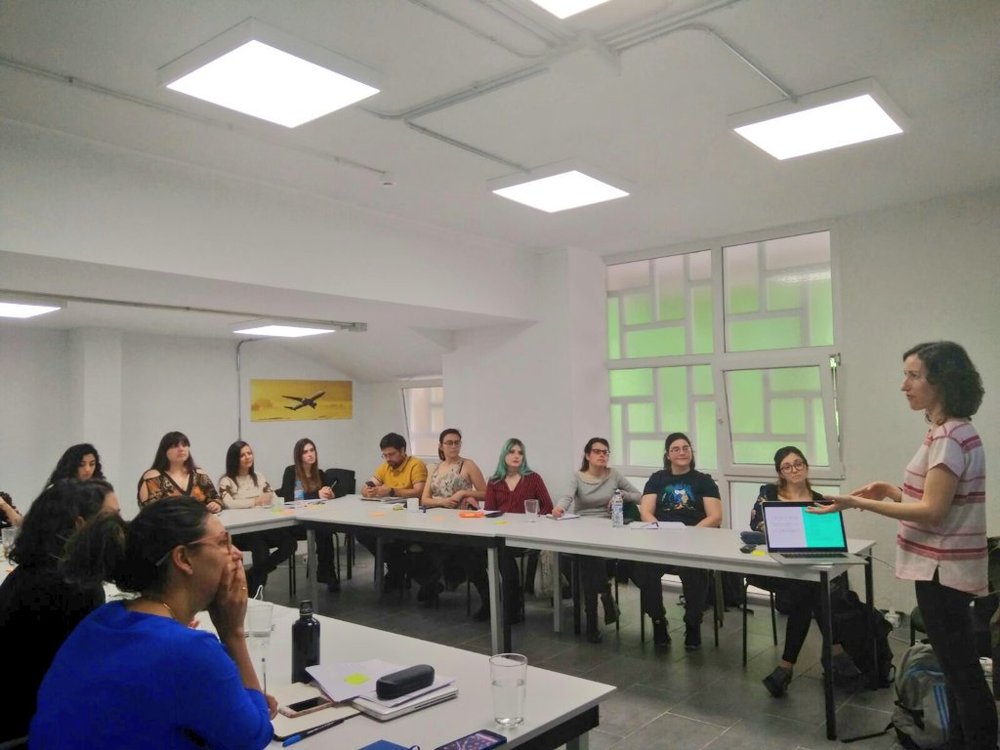
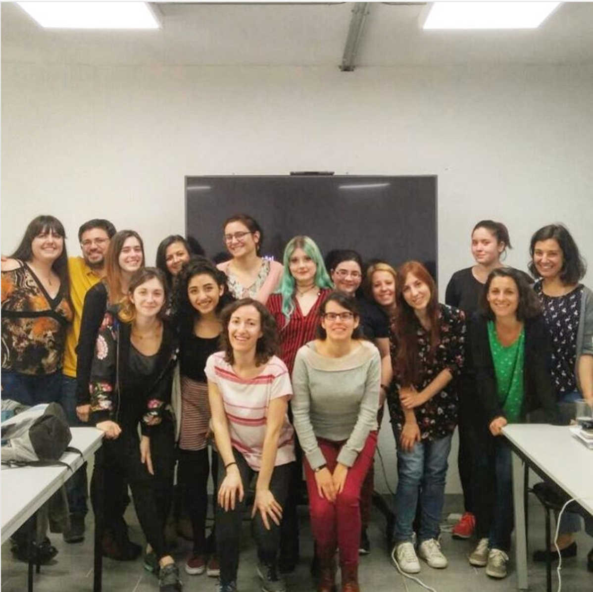

I learned about the <a href="http://adalab.es/">Adalab</a> program in twitter and I started to be curious about it. Adalab is a program to help women to become programmers. The program includes a front-end course, personal development classes and an internship in a company. Moreover, each woman will have a female mentor to help her to start in the tech sector.

I will be a mentor of one of those women in the current course and I have been also a volunteer in a personal development class. 

I was sharing how and why I started to go to conferences and meetups. How I use social networks like Twitter to know more people and events in the tech sector and why I did <a href="../experience-as-a-speaker/">my first talk</a>.

Some images of my talk:

Slides: <a href="https://docs.google.com/presentation/d/1vsDJvhtwE9ldXRDCTeA3XOAUlsubBYisnqUG4Qro2j8/edit?usp=sharing">Google Slides for Adalab program</a>.
