This week I had to manipulate some images at work and I use normally <a href="https://www.gimp.org">GIMP</a> for that. The thing is, I did a GIMP course a while ago and the only functionality that I remember well is the Clone functionality (you clone a region in another part of the picture).

Why do I remember it well? Because I did a collage for two friends about the favourite movie of one of them and I used Clone everywhere (spoiler: the photo is displayed at the end of the post). So if you want to remember something, practice is everything!

## Useful functionalities

From now on, I will explain the most common functionalities with some photos from "Back to the future" movie because I am a fan :)

### Clone

Tools -> Paint tools -> Clone

With the Ctrl key and the mouse you select the source and then you let go of Ctrl and click on the area you'd like
 to cover.

A good example of cloning would be the next photo from the movie:

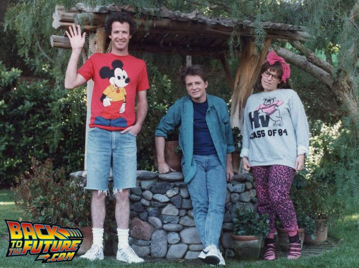

The photo turns into this in some moment of the movie:

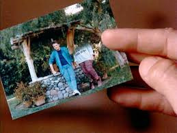

And our test with GIMP:

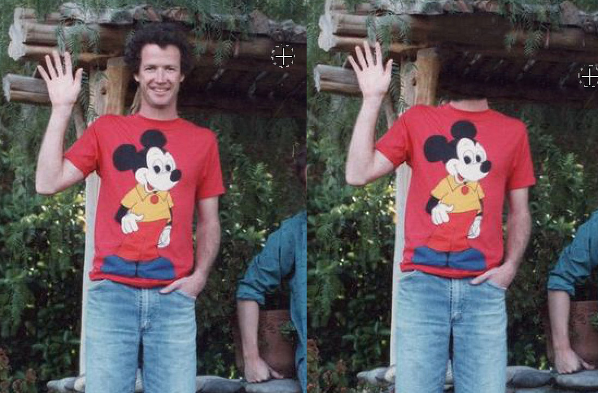

### Crop to selection

To get the part of the image that you need, you can do:

Tools -> Selection Tools -> Rectangle Select

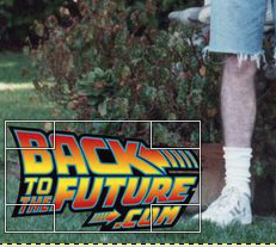

Image -> Crop to Selection

File -> Export as... 

And save as nameFile.jpg or nameFile.png

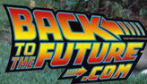

### Transparent background with background with different colors

If the background or the foreground are not made of one color, you can use Free Select to get only the foreground:

Tools -> Selection Tools -> Free Select

You click in different parts of the outline to select only the logo:

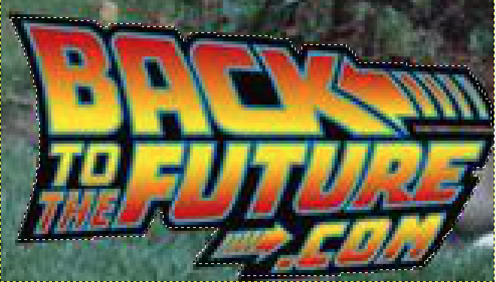

Select -> Invert

Edit -> Cut

To make the background Transparent:

Colors -> Color to Alpha...

File -> Export as... (save the file as png)

### Transparent background with background with one color 

If we want to eliminate the black background of this photo:

Tools -> Selection Tools -> By Color Select and click in the black background

or Tools -> Selection Tools -> Fuzzy Select and select the left and right side of the black background

Edit -> Cut

Colors -> Color to Alpha... (as png)

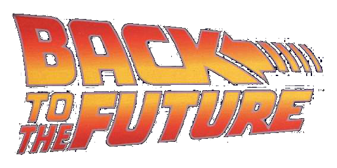

But the result is not very clean.

You can change the threshold that determines the range of colors that will be selected.

Tools -> Selection Tools -> By Color Select

Windows -> Dockable Windows -> Tool Options

The higher the threshold, the larger the resulting selection. We increase the threshold up to 100 and then click in the black background.

Select -> Invert

Edit -> Cut

Colors -> Color to Alpha... (as png)

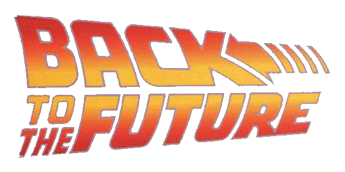

### Rotate

For this functionality we are going to use an image from Back to the future 2. It appears the film Jaws 19. We will change that to be Jaws 61 rotating the numbers:

Tools -> Selection Tools -> Free Select 

Tools -> Transform Tools -> Rotate (Angle 180)

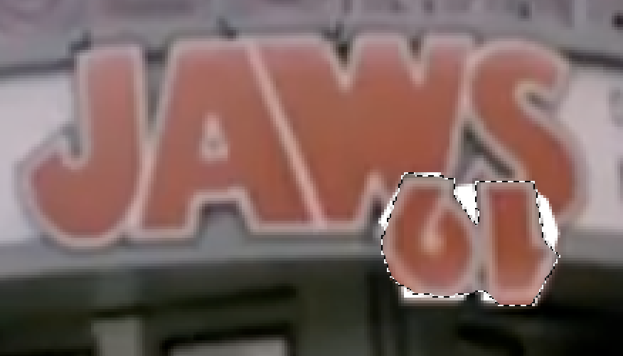

Tools -> Selection Tools -> Rectangle Select 

Click anywhere to deselect the free select

Tools -> Paint Tools -> Clone (to fix the rest of the photo)

Result:

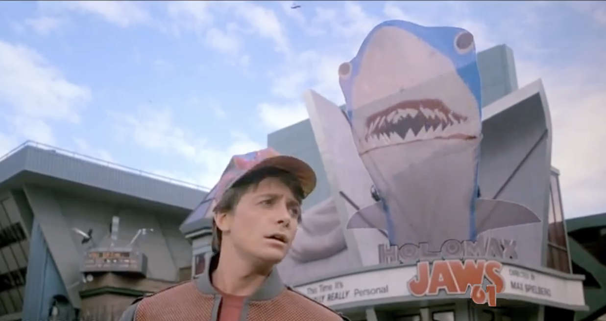

### And now my artistic work

This is The photo that I did mixing 2 favourite movies from a friend:

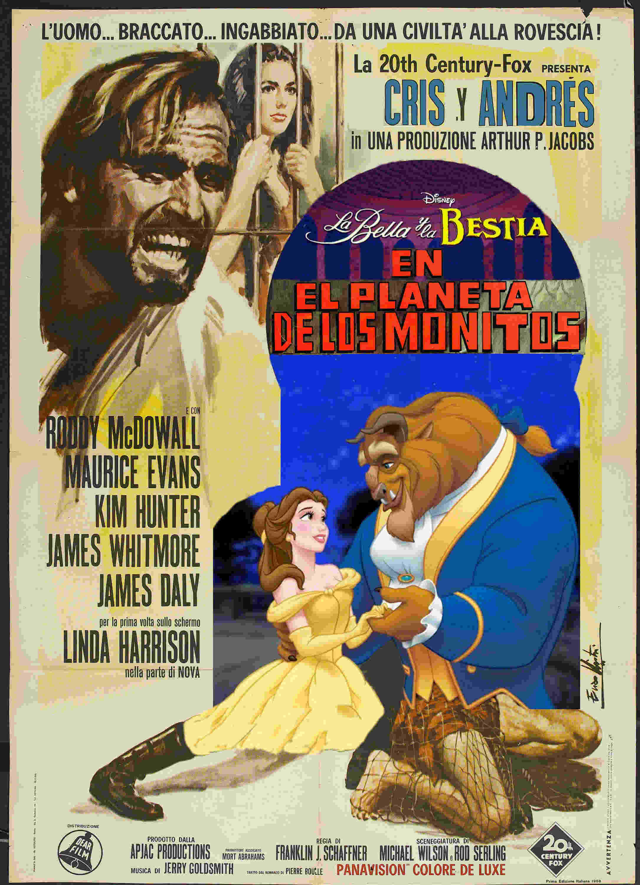

I don't work as a graphic designer, so don't worry too much :)

